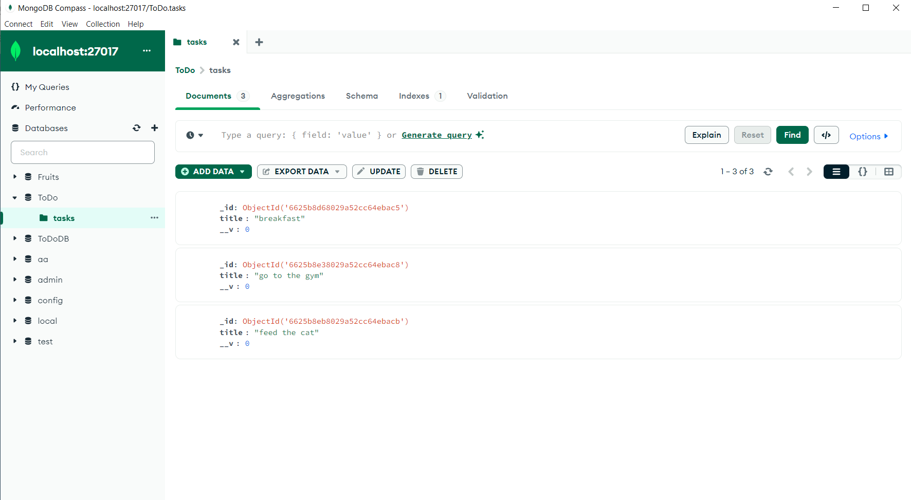

<h5>This is a web app , TODO app that the user can create modify and delete tasks</h5>
    <h6>I used Nodejs for the backend</h6>
    <h6>Java Script for the front End</h6>
    <h6>MongoDb for Data management</h6>

    
    